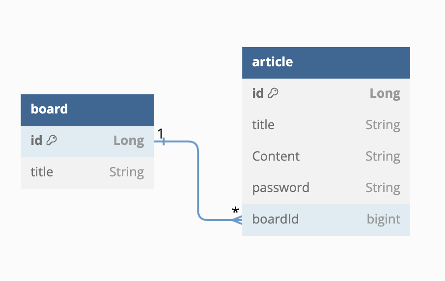
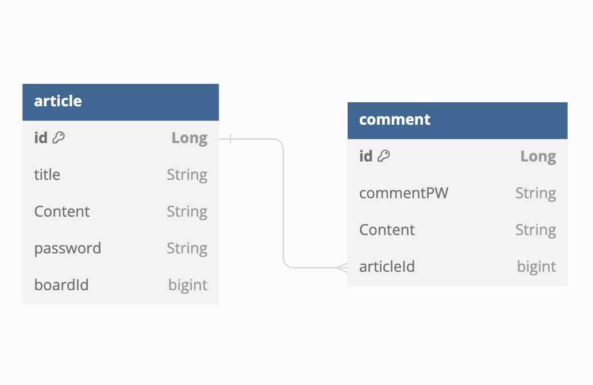

# Mission Project
- **실행 시 jpa.hiberante.ddl-auto: create으로 설정**

## Board - Article
**게시판과 게시글 관계**



## Article - Comment
**게시글과 댓글 관계**



### 게시판 기능
* 게시판 전체 조회
  *  boardRepository.findAll()을 반환한 메서드를 model에 저장하여 read.html에서 보여준다.
      ```java
      @GetMapping
      public String boardReadAll(Model model) {
      model.addAttribute("boards", boardService.readAll());
      return "board/home";
     }
      ```
   
* 게시판 단일 조회 - 게시판 목록을 보여주고 한개의 게시판을 클릭하면 주소의 컨트롤러의 서비스 메서드가 실행되고, 그 결과값을 다시 컨트롤러에 돌려주면 돌아 온 값을 가지고 해당하는 html이나 주소로 발송된다.
  여기서 그 브라우저는 타입립프를 이용해 게시판을 클릭했을 때 게시글을 볼 수있는 엔드포인트로 이동한다.
  * 하나의 게시판을 클릭시 게시글 제목이 나열하기 위해 Model에 객체를 저장하여 "boards"로 저장하고, 게시판서비스에서 전체조회메서드를 가져온다.
   게시판 home.html에서 다음과 같이 사용하였다.
    ```html
    <div th:unless="${boards.isEmpty()}" th:each="board: ${boards}">
    <h3><a th:href="@{/boards/{boardId}/article(boardId=${board.id})}">[[${board.title}]]</a></h3>
    </div>
    ```
  * ArticleRepository에 해당 게시판에 있는 게시글id 기준으로 최신순으로 조회하는 메서드를 만든 후 ArticleService에서 호출
     ```java
     public interface ArticleRepository extends JpaRepository<Article, Long> {
      List<Article> findByBoardIdOrderByIdDesc(Long boardId);
    }
     ```
    ```java
    public List<Article> articleByBoard(Long boardId) {
    return articleRepository.findByBoardIdOrderByIdDesc(boardId);
    }
    ```
  * 하나의 게시판을 클릭하면 해당 게시글로 넘어가고, 게시글 제목은 링크로, 해당 게시글의 정보를 전부 조회할 수 있는 페이지로 이동된다.
    board/read.html로 가면 게시글제목을 입력하면 게시글의 정보를 볼 수 있는 엔드포인트로 이동한다.
    ```java
    @GetMapping("{boardId}/article")
    public String boardReadOne(@PathVariable("boardId") Long boardId, Model model) {
        // 게시판 제목 조회를 위해 넣음
        model.addAttribute("board", boardService.readOne(boardId));
        // 해당 게시판의 게시글 조회
       model.addAttribute("articleList", articleService.articleByBoard(boardId));
        return "board/read";
    }
    ```
* data.aql에 더미데이터를 넣어 게시판에 자유 게시판, 개발 게시판, 일상 게시판, 사건사고 게시판이 존재하게 하였다.

* 전체 게시글을 조회하는 게시판
  * board/home.html에 전체 게시글 게시판에 엔포인트를 article로 넘어가는도록하여 articleController에서 articleService의 모든 게시글을 조회하는 메서드 실행
    ```html
    <div>
      <h4><a href="/article">전체 게시글</a></h4>
    </div>
    ```
    ```java
       @GetMapping
      public String articlesOnAllBoard(Model model) {
          model.addAttribute("articles", articleService.readAll());
          return "article/home";
      }
    ```


### 게시글 기능
* 게시글 등록
  * articleServiced에서 어떤 게시판인지 선택, 게시글 제목과 내용 작성, 비밀번호 입력을 위해 각각의 매개변수를 받아 articleRepository에 저장하는 메서드를 만들고,
    사용자에게서 입력받은 값을 articleService에서 만든 메서드에 넣어준다. 여기서 어떤 게시판인지 선택하는 것은 다음과 같이 구현할 수 있다.
    ```html
    <label>
    <select name="board-id">
      <option
              th:each="board: ${boards}"
              th:value="${board.id}"
      >  [[${board.title}]]
      </option>
    </select>
    </label>
    ```

* 게시글 단일 조회
  * ArticleServic - 조회할 id를 받아 Repository.findById()를 사용한다. 
   여기서 .findById()는 Optional을 발생시킴으로 Optional로 받아 null이 아니면 찾은 값을 아니면 null을 출력한다.
  * ArticleController - articleServic에서 만든 단일조회메서드 가져와서 modle에 "article"로 저장
  
* 게시글 수정
  * 게시글을 작성할 때 사용자가 입력한 비밀번호가 해당 게시글의 비밀번호로 저장되고, 게시글을 수정할 때 비밀번호 확인에 필요한 메서드를 만든다.
    ```java
      // 입력된 비밀번호가 게시글 작성 때 입력한 값과 일치하는가
      public boolean correctPassword(String inputPassword) {
      return this.password.equals(inputPassword);
      }
    ```
  * 수정할 id를 받고, 수정된 게시글의 제목과 내용, 게시글이 속한 게시판id, 수정하기위해 비밀번호도 받는다.
    사용자가 수정한 데이터를 입력한 정보로 업데이트하고, Repository에 저장한다.
    ```java
    public boolean update(
    Long id,
    String articleTitle,
    String content,
    String password,
    Long boardId
    ) {
    Article articleEdit = articleRepository.findById(id).orElse(null);
            // 찾은 게시글이 null이 아니고, 입력된 비밀번호가 맞는 비밀번호면 데이터 수정
            if (articleEdit != null && articleEdit.correctPassword(password)) {
                articleEdit.setTitle(articleTitle);
                articleEdit.setContent(content);
                articleEdit.setBoard(boardRepository.findById(boardId).orElse(null));
                articleRepository.save(articleEdit);
                return true;
            } else {
                return false;
            }
        }
    ```
  
* 게시글 삭제
  * 게시글 수정과 마찬가지로 삭제할 게시글이 존재하고, 비밀번호가 맞으면 삭제한다.
    ```java
    public boolean delete(Long id, String password) {
    Article articleDelete = articleRepository.findById(id).orElse(null);
  
            if (articleDelete != null && articleDelete.correctPassword(password)) {
                articleRepository.deleteById(id);
                return true;
            } else {
                return false;
            }
        }
    ``` 

### 댓글 기능
* 댓글 등록
  * 게시글 단일 조회페이지에서 댓글 등록 - 입력받을 객체와 댓글이 입력될 게시글의ID를 설정하고, articleId를 이용하여 Article 객체를 만들었다. 
    게시글이 null이 아니면 댓글이 있는 해당 게시글을 설정하고, 댓글을 저장
    댓글을 등록하면 게시글 화면에서 조회 가능
    ```java
    public Comment create(
    String content,
    String commentPW,
    Long articleId
    ) {
    Comment comment = new Comment();
    comment.setContent(content);
    comment.setCommentPassword(commentPW);
    Article article = articleService.readOne(articleId);
    // 댓글이 해당되는 게시글 넣기
    comment.setArticle(article);
    commentRepository.save(comment);
    return comment;
    }
    ```
* 댓글 조회
  * 게시글 단일 조회페이지에서 목록보기 - CommentRepository에 해당 게시글을 찾는 메서드를 만들어 해당 게시글만 조회하는 곳에서 같이 사용한다.
    ```java
    public interface CommentRepository extends JpaRepository<Comment, Long> {
    List<Comment> findByArticleId(Long articleId);
    }
    ```
* 댓글 삭제
  * 댓글 삭제를 위해서 댓글 등록할 때 입력한 비밀번호와 일치해야한다. 게시글에서 했던 것처럼 일치하는지 확인하는 메서드 만들어 CommentService에서 사용한다.
    ```java
    public boolean delete(Long commentId, String commentPW) {
          Comment commentDelete = commentRepository.findById(commentId).orElse(null);

          if (commentDelete != null && commentDelete.correctPassword(commentPW)) {
              commentRepository.deleteById(commentId);
          }
          return false;
      }
    ```
  

---

## 어려웠던 점
- 1:N 관계을 연결하는 과정에서 1에서 N을 보여줘야한다는 부분
- 어떻게 하면 된다는 생각은 있는데 코드로 구현을 하려는 부분에서 막히는 부분들이 있었다.
- 게시글을 만드는 과정에서 crete.html에서 form에 액션을 넣어줘야하는 것은 알고 있는 부분이었는데
오류가 나서 확인한 결과 action에 엔드포인트를 중복으로 넣었다 어떻게 이동하면 좋을지에 대한 고민이 있었다.
- "There was an unexpected error (type=Not Found, status=404)"의 대한 오류가 많이 발생하였다.엔드포인트 설정을 잘해 주지 못해서 발생하였었고, 마라미터로 받는 값들에 대해서 고민과 연결이 어려웠다.
- html에서 "Attempted to call method isEmpty() on null context object"오류 발생
- 게시글이 최신순으로 작성되는 html에서 객체를 가져오는 부분에서 객체부분에 오류가 떠서 찾아본 결과 model에 객체를 넣어주지 않아서 그런거였고, html에서 객체를 사용하고 싶다면
model에 필요한 객체를 넣어서 사용해야된다는 것을 자세히 알게 되었다.
- 비밀번호를 일치하는지 확인하는 과정이 생각은 어떻게 하면 된다는 것을 알고 있었지만 코드로 표현하는데 어려움을 느꼈다.
- 어디까지가 각자의 기능인지 헷갈려서 처음에는 구분을 못하고 게시글에서 댓글을 구현했었다.

## 구현 못한 점
- 게시판 부분에서 미리 더미데이터를 넣었지만 jpa.hibernate.ddl-auto: update로 설정시 계속해서 데이터가 넣어진 부분은 해결 못했다.
- 게시글 삭제 시 이동하는 곳이 해당 게시판이어야하는데 전체 게시판 목록으로 이동한다.

## 실행 테스트
1. jpa.hiberante.ddl-auto: create으로 설정 후 실행
2. http://localhost:8080/boards 에서 시작하고 엔드포인트로 이동하면 게시판 목록이 나온다.
3. 게시판 클릭 시 게시글이 있으면 제목이 나오고, 게시글 작성과 돌아가기 버튼이 있다.
4. 게시글 작성 버튼 누르면 게시판을 선택하는 것과 게시글의 제목, 내용, 비밀번호를 제출 할 수 있다. 
5. 제출 버튼을 누르면 해당 게시판의 게시글 목록페이지로 다시 돌아간다.
6. 게시글 수정 버튼 클릭 시 비밀번호가 일치하면 게시판 페이지로 이동, 틀리면 수정 페이지 유지된다. 
7. 만든 게시글을 클릭 시 해당 게시글의 정보를 볼 수 있고, 댓글을 달 수 있다. 
8. 댓글과 댓글 비밀번호를 입력 시 게시글 화면에서 댓글을 볼 수 있다. 
9. 댓글 비밀번호를 입력하면 댓글 삭제 가능, 게시글 비밀번호를 입력하면 게시글 삭제 가능하다.
10. 게시판 목록에 보면 전체 게시글을 조회할 수 있는 전체 게시글 게시판이 있다. 클릭 시 작성한 모든 게시글을 볼 수 있다.
